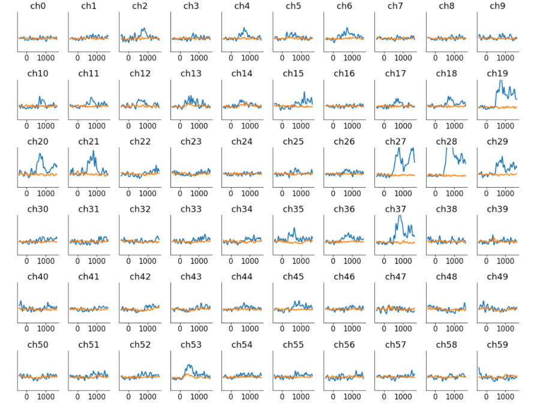
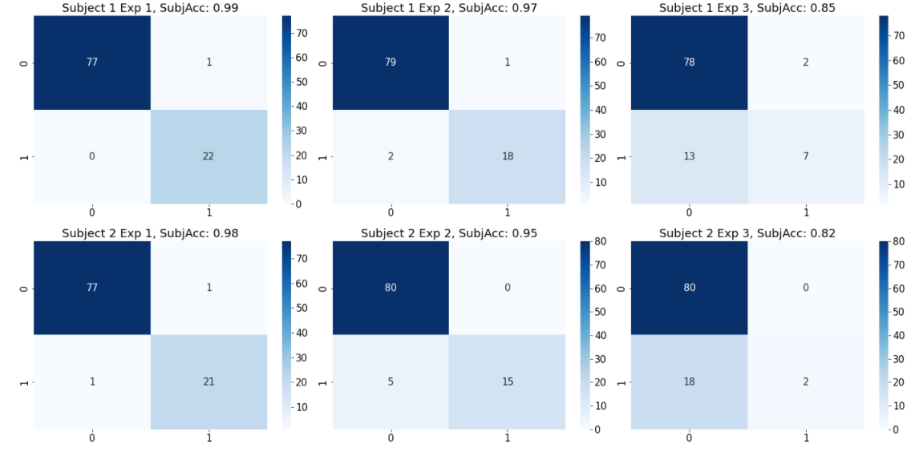
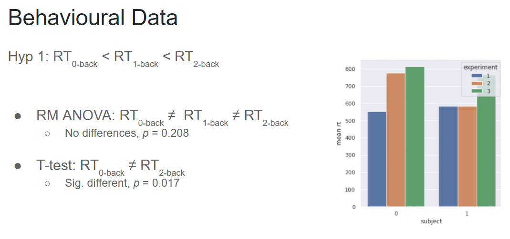
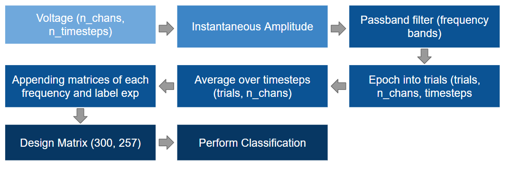
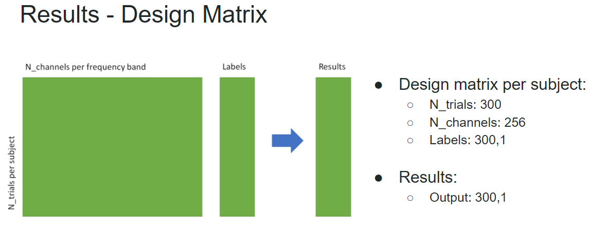
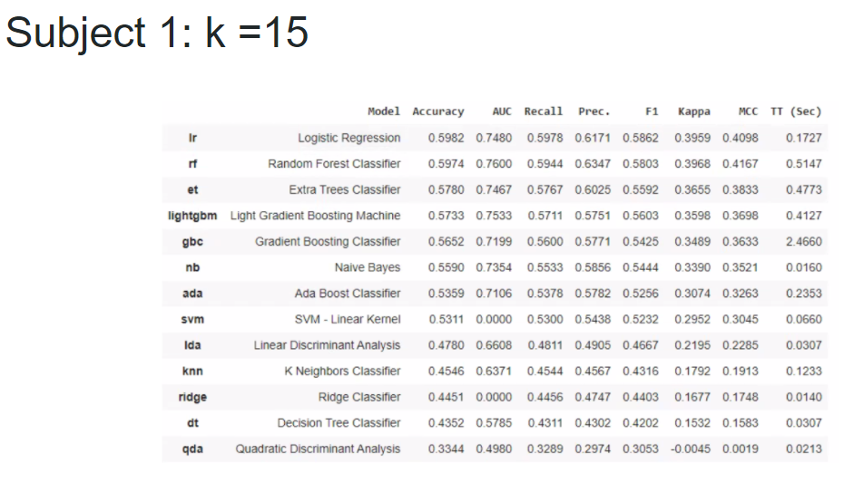
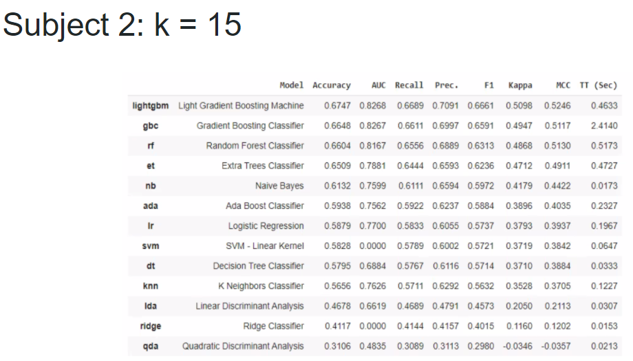

# ECoG as an Indicator of Working Memory load on an N-back task
## Overview
This project was done during the course of Computer Neurosciences of Neuromatch Academy in July 2021. The purpose of this analysis is to find a correlation in <code>N-Back</code> tasks increase with <code>Working Memory Load</code>
ECoG data from 3 different subjects were used in order to attempt to dessign a classifier that can classify the N-back task by the neural activity and proof that N-back task is a valid assesment of WM.
## Dataset Info
This is one of multiple ECoG datasets from Miller 2019, recorded in clinical settings with a variety of tasks. Raw data here:

https://exhibits.stanford.edu/data/catalog/zk881ps0522

dat contain 3 sessions from 3 subjects, and was not yet used in a publication, so it's fresh data for you to analyze! The following references using other datasets may be useful for the memory n-back task:

Brouwer, Anne-Marie, et al. "Estimating workload using EEG spectral power and ERPs in the n-back task." Journal of neural engineering 9.4 (2012): 045008.

Grissmann, Sebastian, et al. "Electroencephalography based analysis of working memory load and affective valence in an n-back task with emotional stimuli." Frontiers in human neuroscience 11 (2017): 616.

Each subject's data is divided into 5 sessions: fixation, exp1, exp2, exp3, fixation, which are consecutive blocks in the data structure (i.e. alldat[0][0], alldat[0][1], ..., alldat[0][4] for subject 0). <code>Exp1</code> is a <code>"0-back"</code> memory experiment, where the subjects have to identify the picture of one of the houses (stimid = 10), which they have memorized at the beginning of the stimulus block. <code>Exp2</code> is a <code>1-back</code> memory experiment, where the participants have to respond to images of repeated houses. Finally, <code>Exp3</code> is <code>2-back</code> where participants respond to pictures of houses that are repeated after another intervening random picture. This task was hard for these participants and most of them did not really respond at all, but the data can still be used to ask questions about overall shifts of neural activity in a hard task when the subjects feel overwhelmed by the memory requirements.

Note that for the third/last subject, no response data was collected, so only the first two subjects can be analyzed for their correct / incorrect trials.

Sample rate is always <code>1000Hz</code>, and the ECoG data has been notch-filtered at 60, 120, 180, 240 and 250Hz, followed by z-scoring across the entire recording and conversion to float16 to minimize size.

Variables for each block within each subject:

* <code>dat['V']</code>: continuous voltage data (time by channels)
* <code>dat['expinfo']</code>: experiment type for this block
* <code>dat['srate']</code>: sampling rate for voltage data, always 1000Hz
* <code>dat['t_on']</code>: time of stimulus onset in data samples
* <code>dat['t_off']</code>: time of stimulus offset, usually 600 samples after t_on
* <code>dat['stim_id]</code>: identity of house stimulus from 1 to 40. Stimulus 10 was the target in the 0-back task.
* <code>dat['target']</code>: 0 or 1, indicates if this stimulus requires a response
* <code>dat['response']</code>: 0 or 1, indicates if the subject actually made a response
* <code>dat['rt']</code>: reaction time for trials with a response in voltage data samples (1000Hz).
* <code>dat['locs']</code>: 3D locations of the electrodes on the cortical surface

## Exploratory Analysis
First we explored the channels that were activated during the intervals where the subject required to perform a response to the experiment stimulus and identify which channels where activated as shown in the image below:

  

Also we explored the reaction times that each one of the three subjects had as follows:
* Our hypothesis was that <code>Reaction times will be slower for the trials with higher WM load</code>
* Our null hypothesis was that <code>Reaction time across different N-back tasks doesn't change</code>

  

An Anova test was performed in order to find out the p value and find the significance of our hypothesis as shown below:

  

With this we can infer that there is no significant difference by each consecutive increasing N-back task, however, if we compare the reaction times from 0-back with the reaction times from 2-back, we obtain a p-value of 0.017 and we can reject our null hypothesis.

## Data Pipeline
The process that we made to explore and analysis the data is as follows:
* Obtain the Voltage vector presentend during the experiment.
* Obtain the Instantaneous Amplitude from the voltage vector.
* Apply a passband filter by each frequency band as follows:
  * <code>Delta</code> : Passband filter from <code>1-3hz</code>
  * <code>Theta</code> : Passband filter from <code>4-7hz</code>
  * <code>Alpha</code> : Passband filter from <code>8-13hz</code>
  * <code>Gamma</code> : Passband filter from <code>30-80hz</code>
* Obtain the epochs into trials (Parts of the experiment were the subject was required to perform a response to the stimuli.)
* Average the signals over timesteps.
* Appending each one of the matrices generated by each frequency band to obtain our <code>Dessign Matrix</code> 
* Perform Classification with PyCaret Library.
The process is visually shown in the image below and the dimensions of every step can be seen.

  

## Classification
After appending each of the matrices generated by our frequency bands of interest, we merged 60 channels of 5 different frequency bands over 100 trials per N-back task, obtaining a matrix with the following dimensions:

  

After obtain our dessign matrix, we fitted our data into PyCaret classification library, which allows to use multiple classifiers at the same time. We defined our cross validation to 15 folds and the results of each subject is shown below:

Subject 1: k=15  |  Subject 2: k=15
:-------------------------:|:-------------------------:
    | 

